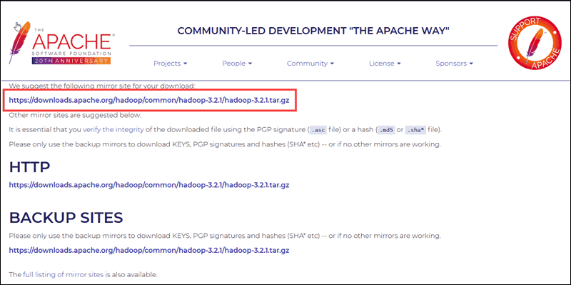

# Introduction

Every major industry is implementing Apache Hadoop as the standard framework for processing and storing big data. Hadoop is designed to be deployed across a network of hundreds or even thousands of dedicated servers. All these machines work together to deal with the massive volume and variety of incoming datasets.

Deploying Hadoop services on a single node is a great way to get yourself acquainted with basic Hadoop commands and concepts.

This easy-to-follow guide helps you install Hadoop on Ubuntu 18.04 or Ubuntu 20.04.

## Prerequisites

- Access to a terminal window/command line
- **Sudo** or **root** privileges on local /remote machines

## Install OpenJDK on Ubuntu

The Hadoop framework is written in Java, and its services require a compatible Java Runtime Environment (JRE) and Java Development Kit (JDK). Use the following command to update your system before initiating a new installation:

```shell [3] copy
sudo apt update
```

At the moment, **Apache Hadoop 3.x fully supports Java 8**. The OpenJDK 8 package in Ubuntu contains both the runtime environment and development kit.

Type the following command in your terminal to install OpenJDK 8:

```shell [3] copy
sudo apt install openjdk-8-jdk -y
```

The OpenJDK or Oracle Java version can affect how elements of a Hadoop ecosystem interact. To install a specific Java version, check out our detailed guide on how to install Java on Ubuntu.

Once the installation process is complete, verify the current Java version:

```shell [3] copy
java -version; javac -version
```

The output informs you which Java edition is in use.


## Set Up a Non-Root User for Hadoop Environment

It is advisable to create a non-root user, specifically for the Hadoop environment. A distinct user improves security and helps you manage your cluster more efficiently. To ensure the smooth functioning of Hadoop services, the user should have the ability to establish a passwordless SSH connection with the localhost.

## Install OpenSSH on Ubuntu

Install the OpenSSH server and client using the following command:

```shell [3] copy
sudo apt install openssh-server openssh-client -y
```

In the example below, the output confirms that the latest version is already installed.


## Create Hadoop User

Utilize the **adduser** command to create a new Hadoop user:

```shell [3] copy
sudo adduser hdoop
```

The username, in this example, is **hdoop**. You are free the use any username and password you see fit. Switch to the newly created user and enter the corresponding password:

```shell [3] copy
su - hdoop
```

The user now needs to be able to SSH to the localhost without being prompted for a password.

## Enable Passwordless SSH for Hadoop User

Generate an SSH key pair and define the location is is to be stored in:

```shell [3] copy
ssh-keygen -t rsa -P '' -f ~/.ssh/id_rsa
```

The system proceeds to generate and save the SSH key pair.


Use the **cat** command to store the public key as **authorized_keys** in the ssh directory:

```shell [3] copy
cat ~/.ssh/id_rsa.pub >> ~/.ssh/authorized_keys
```

Set the permissions for your user with the **chmod** command:

```shell [3] copy
chmod 0600 ~/.ssh/authorized_keys
```

```shell [3] copy
ssh localhost
```

The new user is now able to SSH without needing to enter a password every time. Verify everything is set up correctly by using the hdoop user to SSH to localhost:
After an initial prompt, the Hadoop user is now able to establish an SSH connection to the localhost seamlessly.

## Download and Install Hadoop on Ubuntu

Visit the official [Apache Hadoop](https://hadoop.apache.org/releases.html) project page, and select the version of Hadoop you want to implement.

The steps outlined in this tutorial use the Binary download for **Hadoop Version 3.2.1**.

Select your preferred option, and you are presented with a mirror link that allows you to download the **Hadoop tar package**.

Use the provided mirror link and download the Hadoop package with the **wget** command:


```shell [3] copy
wget https://dlcdn.apache.org/hadoop/common/hadoop-3.2.4/hadoop-3.2.4.tar.gz
```


Once the download is complete, extract the files to initiate the Hadoop installation:

```shell [3] copy
tar xzf hadoop-3.2.1.tar.gz
```

The Hadoop binary files are now located within the hadoop-3.2.1 directory.

## Single Node Hadoop Deployment (Pseudo-Distributed Mode)

Hadoop excels when deployed in a **fully distributed mode** on a large cluster of networked servers. However, if you are new to Hadoop and want to explore basic commands or test applications, you can configure Hadoop on a single node.

This setup, also called **pseudo-distributed mode**, allows each Hadoop daemon to run as a single Java process. A Hadoop environment is configured by editing a set of configuration files:

- bashrc
- hadoop-env.sh
- core-site.xml
- hdfs-site.xml
- mapred-site-xml
- yarn-site.xml

## Configure Hadoop Environment Variables (bashrc)

Edit the .bashrc shell configuration file using a text editor of your choice (we will be using nano):

```shell [3] copy
sudo nano .bashrc
```

Define the Hadoop environment variables by adding the following content to the end of the file:

```xml [3] copy
#Hadoop Related Options
export HADOOP_HOME=/home/hdoop/hadoop-3.2.1
export HADOOP_INSTALL=$HADOOP_HOME
export HADOOP_MAPRED_HOME=$HADOOP_HOME
export HADOOP_COMMON_HOME=$HADOOP_HOME
export HADOOP_HDFS_HOME=$HADOOP_HOME
export YARN_HOME=$HADOOP_HOME
export HADOOP_COMMON_LIB_NATIVE_DIR=$HADOOP_HOME/lib/native
export PATH=$PATH:$HADOOP_HOME/sbin:$HADOOP_HOME/bin
export HADOOP_OPTS"-Djava.library.path=$HADOOP_HOME/lib/nativ"
```

Once you add the variables, save and exit the .bashrc file.


It is vital to apply the changes to the current running environment by using the following command:

```shell [3] copy
source ~/.bashrc
```

## Edit hadoop-env.sh File

The hadoop-env.sh file serves as a master file to configure YARN, HDFS, MapReduce, and Hadoop-related project settings.

When setting up a **single node Hadoop cluster**, you need to define which Java implementation is to be utilized. Use the previously created **$HADOOP_HOME** variable to access the hadoop-env.sh file:

```shell [3] copy
sudo nano $HADOOP_HOME/etc/hadoop/hadoop-env.sh
```

Uncomment the **$JAVA_HOME** variable (i.e., remove the # sign) and add the full path to the OpenJDK installation on your system. If you have installed the same version as presented in the first part of this tutorial, add the following line:

```xml [3] copy
export JAVA_HOME=/usr/lib/jvm/java-8-openjdk-amd64
```

The path needs to match the location of the Java installation on your system.


If you need help to locate the correct Java path, run the following command in your terminal window:

```shell [3] copy
which javac
```

The resulting output provides the path to the Java binary directory.


Use the provided path to find the OpenJDK directory with the following command:

```shell [3] copy
readlink -f /usr/bin/javac
```

The section of the path just before the /bin/javac directory needs to be assigned to the **$JAVA_HOME** variable.


## Edit core-site.xml File

The core-site.xml file defines HDFS and Hadoop core properties.

To set up Hadoop in a pseudo-distributed mode, you need to **specify the URL** for your NameNode, and the temporary directory Hadoop uses for the map and reduce process.

Open the core-site.xml file in a text editor:

```shell [3] copy
sudo nano $HADOOP_HOME/etc/hadoop/core-site.xml
```

Add the following configuration to override the default values for the temporary directory and add your HDFS URL to replace the default local file system setting:

```xml [3] copy
<configuration>
<property>
  <name>hadoop.tmp.dir</name>
  <value>/home/hdoop/tmpdata</value>
</property>
<property>
  <name>fs.default.name</name>
  <value>hdfs://127.0.0.1:9000</value>
</property>
</configuration>
```

This example uses values specific to the local system. You should use values that match your systems requirements. The data needs to be consistent throughout the configuration process.


Do not forget to create a Linux directory in the location you specified for your temporary data.

## Edit hdfs-site.xml File

The properties in the hdfs-site.xml file govern the location for storing node metadata, fsimage file, and edit log file. Configure the file by defining the **NameNode** and **DataNode** storage directories.

Additionally, the default **dfs.replication** value of **3** needs to be changed to **1** to match the single node setup.

Use the following command to open the hdfs-site.xml file for editing:

```shell [3] copy
sudo nano $HADOOP_HOME/etc/hadoop/hdfs-site.xml
```

Add the following configuration to the file and, if needed, adjust the NameNode and DataNode directories to your custom locations:

```xml [3] copy
<configuration>
<property>
  <name>dfs.data.dir</name>
  <value>/home/hdoop/dfsdata/namenode</value>
</property>
<property>
  <name>dfs.data.dir</name>
  <value>/home/hdoop/dfsdata/datanode</value>
</property>
<property>
  <name>dfs.replication</name>
  <value>1</value>
</property>
</configuration>
```

If necessary, create the specific directories you defined for the **dfs.data.dir** value.


## Edit mapred-site.xml File

Use the following command to access the mapred-site.xml file and define **MapReduce** values:

```shell [3] copy
sudo nano $HADOOP_HOME/etc/hadoop/mapred-site.xml
```

Add the following configuration to change the default MapReduce framework name value to **yarn**:

```xml [3] copy
<configuration>
<property>
  <name>mapreduce.framework.name</name>
  <value>yarn</value>
</property>
</configuration>
```


## Edit yarn-site.xml File

The yarn-site.xml file is used to define settings relevant to **YARN**. It contains configurations for the **Node Manager, Resource Manager, Containers, and Application Master**.

Open the yarn-site.xml file in a text editor:

```shell [3] copy
sudo nano $HADOOP_HOME/etc/hadoop/yarn-site.xml
```

Append the following configuration to the file:

```xml [3] copy
<configuration>
<property>
  <name>yarn.nodemanager.aux-services</name>
  <value>mapreduce_shuffle</value>
</property>
<property>
  <name>yarn.nodemanager.aux-services.mapreduce.shuffle.class</name>
  <value>org.apache.hadoop.mapred.ShuffleHandler</value>
</property>
<property>
  <name>yarn.resourcemanager.hostname</name>
  <value>127.0.0.1</value>
</property>
<property>
  <name>yarn.acl.enable</name>
  <value>0</value>
</property>
<property>
  <name>yarn.nodemanager.env-whitelist</name>
  <value>JAVA_HOME,HADOOP_COMMON_HOME,HADOOP_HDFS_HOME,HADOOP_CONF_DIR,CLASSPATH_PERPEND_DISTCACHE,HADOOP_YARN_HOME,HADOOP_MAPRED_HOME</value>
</property>
</configuration>
```


## Format HDFS NameNode

It is important to **format the NameNode** before starting Hadoop services for the first time:

```shell [3] copy
hdfs namenode -format
```

The shutdown notification signifies the end of the NameNode format process.


## Start Hadoop Cluster

Navigate to the hadoop-3.2.1/sbin directory and execute the following commands to start the NameNode and DataNode:

```shell [3] copy
./start-dfs.sh
```

The system takes a few moments to initiate the necessary nodes.


Once the namenode, datanodes, and secondary namenode are up and running, start the YARN resource and nodemanagers by typing:

```shell [3] copy
./start-yarn.sh
```

As with the previous command, the output informs you that the processes are starting.


Type this simple command to check if all the daemons are active and running as Java processes:

```shell [3] copy
jps
```

If everything is working as intended, the resulting list of running Java processes contains all the HDFS and YARN daemons.


## Access Hadoop UI from Browser

Use your preferred browser and navigate to your localhost URL or IP. The default port number **9870** gives you access to the Hadoop NameNode UI:

```[3] copy
http://localhost:9870
```

The NameNode user interface provides a comprehensive overview of the entire cluster.


The default port **9864** is used to access individual DataNodes directly from your browser:

```[3] copy
http://localhost:9864
```


The YARN Resource Manager is accessible on port **8088**:

```[3] copy
http://localhost:8088
```

The Resource Manager is an invaluable tool that allows you to monitor all running processes in your Hadoop cluster.


## Conclusion

You have successfully installed Hadoop on Ubuntu and deployed it in a pseudo-distributed mode. A single node Hadoop deployment is an excellent starting point to explore basic HDFS commands and acquire the experience you need to design a fully distributed Hadoop cluster.
